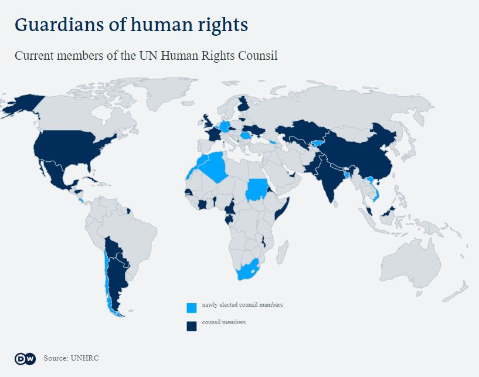
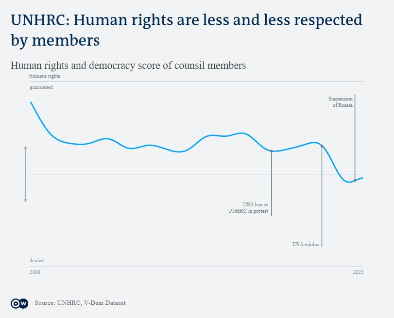
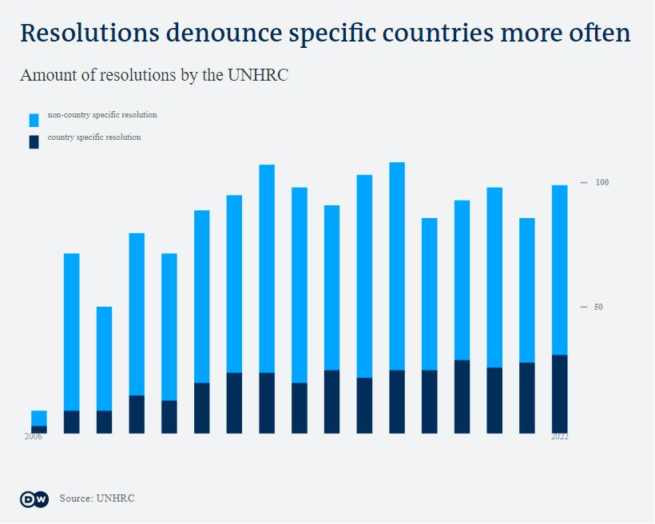

# Natural Sinks

_Idea:_  [Michel Penke](https://michelpenke.de)\
_Research, data analysis and data visualization:_  [Michel Penke](https://michelpenke.de)\
_Writing:_  [Michel Penke](https://michelpenke.de)

**Read the full articles on DW.com:**
- [XXX](XXX)

Threats, impositions and blockades - autocracies have the majority in the UN Human Rights Council today and protect each other from criticism. But even NGOs do not want to reform it. The worry is that things could get even worse.  

The following text will explain the process behind this story: Which data sources were used, how the analysis was conducted and how the data was visualized.

# Source data

| **Data** | **Source** | **Link** |
| --- | --- | --- |
| Documents and Resolutions | UNHRC| [Data](https://www.ohchr.org/en/hr-bodies/hrc/documents ) |
| Regular sessions | UNHRC | [Data](https://www.ohchr.org/en/hr-bodies/hrc/regular-sessions)|
| The V-Dem Dataset | Varities of Democracy | [Data](https://www.v-dem.net/data/the-v-dem-dataset/)|

# Analysis
### Human Rights Council

The first chart is a simple illustration of the members of the Human Rights Counsil. Every year, the Council elects one third of its members. After three years, each country leaves again. In addition, there are politically determined, geographical quotas: Asia and Africa each send 13 members, Western Europe and North America 7, Eastern Europe 6 and Latin America 8.

### Human Rights Score of the Council

For the second graph, the human rights score of each member country was determined for those years in which it was a member. For this purpose, the V-Dem score was used and the individual factors v2x_polyarchy and v2x_liberal were calculated ([Codebook](https://www.v-dem.net/static/website/img/refs/codebookv111.pdf)). 

#### v2x_polyarchy
The electoral principle of democracy seeks to embody the core value of making rulers responsive to citizens, achieved through electoral competition for the electorate’s approval under circumstances when suffrage is extensive; political and civil society organizations can operate freely; elections are clean and not marred by fraud or systematic irregularities; and elections affect the composition of the chief executive of the country. In between elections, there is freedom of expression and an independent media capable of presenting alternative views on matters of political relevance. In the V-Dem conceptual scheme, electoral democracy is understood as an essential element of any other conception of representative democracy — liberal, participatory, deliberative, egalitarian, or some other.

#### v2x_liberal
The liberal principle of democracy emphasizes the importance of protecting individual and minority rights against the tyranny of the state and the tyranny of the majority. The liberal model takes a "negative" view of political power insofar as it judges the quality of democracy by the limits placed on government. This is achieved by constitutionally protected civil liberties, strong rule of law, an independent judiciary, and effective checks and balances that, together, limit the exercise of executive power. To make this a measure of liberal democracy, the index also takes the level of electoral democracy into account.

At the end, the members' human rights scores for each year were tallied and the median calculated. 

_Caveats: Since the quantification of the granting of human rights is determined subjectively by researchers, another index, the [Democracy Matrix](https://www.demokratiematrix.de), was used for the purpose of verification and the median was determined using the same procedure. The results of the V-Dem and Democracy Matrix showed a high degree of agreement._

### Resolutions

For the presentation of the UNHRC's resolutions, the organisation's website was scrapped and analysed. For the classification into country-specific and non-country-specific, it was checked whether a geographical location existed in the title of the resolution. For this purpose, the UN's glossary of terms for geographical locations was used. 

_Caveats: It is possible that individual geographical names that are not country names (e.g. "Darfur") were not included in the UN glossary and were therefore not recognised during the identification process. However, these are likely to be isolated cases that should not have noticeably changed the result and the presentation._
